# Afficionado Coffee Roaster Analysis

_Analyzing Sales Trend and time-based perfomance analysis to support strategic sales and staffing schedules using pandas, plotly and streamlit for dashboard._

---

## Tables of Contents
- <a href = '#overview'>Overview</a>
- <a href = '#business-problem'>Business Problem</a>
- <a href = '#objective'>Objective</a>
- <a href = '#dataset'>Dataset</a>
- <a href = '#project-structure'>Project Structure</a>
- <a href = '#data-cleaning'>Data cleaning and Preparation</a>
- <a href = '#tech-stack'>Tech Stack</a>
- <a href = '#key-feature'>Key Feature</a>
- <a href = '#system-architecture'>System Architecture</a>
- <a href = '#Dashboard-screenshot'>Dashboard Screenshot</a>
- <a href = '#watch-full-dashboard'>Watch Full Dashboard</a>
- <a href = '#contact'>Contact</a>

---
<h2><a class="anchor" id="overview"></a>Overview</h2>

This project focused on **Sales Trends and Time-Based Performance Analysis** for coffee retail chain. 
The Dashboard transaform raw data into meaningful insights, help business customer behavior and improve decision making.

<h2><a class="anchor" id="business-problem"></a>Business Problem</h2>

**Business face several issue:**
1. Limited visibility into time-based sales pattern
2. Difficulty to indentify peak hour
3. Store-level comparison performance

<h2><a class="anchor" id="objective"></a>Objective</h2>

- Analysis **daily, weekly, and monthly sales trends**
- Identify **peak demands hour**
- Compare **store-level comparison**
- Generate **actionable business insights**

<h2><a class = "anchor" id = "dataset"></a>Dataset</h2>

Excel file is located in '/update_data/' folder
Also clean excel data is available in '/update_data/' folder

<h2><a class = "anchor" id = "project-structure"></a>Project Structure</h2>

```
├── app.py
├── feature_engineer.py
├── sales_trends.py
├── Day_week_perform.py
├── time_demand.py
├── cross_location.py
├── update_data/
│   └── Afficionado Coffee Roasters.xlsx
│   └── cleandata.xlsx
├── images/
├── README.md
```

<h2><a class = "anchor" id = "data-cleaning"></a>Data cleaning and Preparation</h2>

In dataset we have only time so we have added a own **Date** using pandas code and other thing regarding dataset is cleaned by coffee retailer

<h2><a class = "anchor" id = "tech-stack"></a>Tech Stack</h2>

**Python**
- **Pandas** - Data Processing and analysis
- **Plotly** - Interactive Visualization
- **Streamlit** - Dashboard Development
- **Excel** - Data source

<h2><a class = "anchor" id = "key-feature"></a>Key Feature</h2>

## 1. Sales Trends analysis
- Daily trend (Area chart)
- Weekly and Monthly trend (Bar chart)
- Sote-level comparison (Line chart)

## 2. Week Performance
- Days Revenue (Bar chart)
- Week vs Weekend (Bar chart)
- Customer behavior insight

## 3. Hourly Demands
- Hourly revenue (Line chart)
- Peak hour identification

## 4. Location Analysis
- Hourly heatmap per store (heatmap)
- Location specific customer behavior insights
- Identification of high traffic store 

<h2><a class = "anchor" id = "system-architecture"></a>System Architecture</h2>

```
Excel Dataset
     ↓
Data Preprocessing (Pandas)
     ↓
Feature Engineering
     ↓
Data Filtering (Sidebar Inputs)
     ↓
Data Aggregation (GroupBy Functions)
     ↓
Visualization (Plotly Charts)
     ↓
Interactive Dashboard (Streamlit UI)
```

<h2><a class = "anchor" id = "dashboard-screenshot"></a>Dashboard Screenshot</h2>

- **Streamlit Dasboard Shows:**
   - First Page UI Image
   - Sales Trends Images
   - Weekly Performance Images
   - Hourly Demands Images
   - Location Analysis Images

**First Page UI Image**
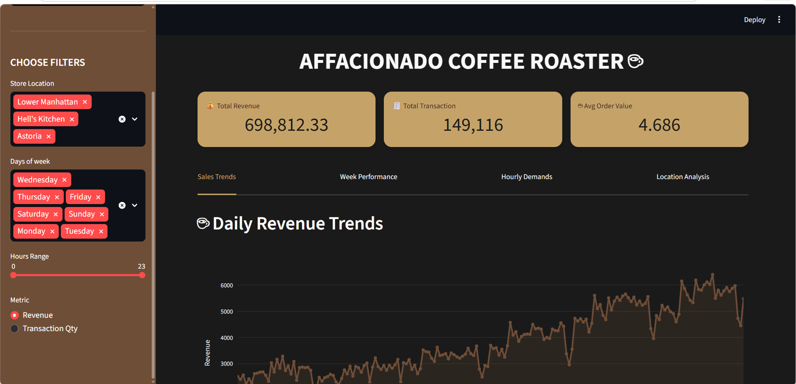

I have shared this UI to show you the **filter** I have used also the **KPIs** shows the **total revenues, transaction count and Average Order value** 

---

**Sales Trends**

*Daily Trends*
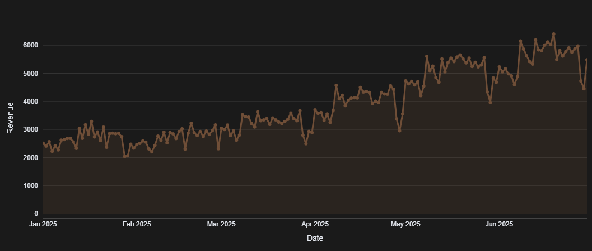

Area chart display the fluctuation of daily sales trend help to see increasing and secreasing of sales over a month.

---

*Weekly Trend*
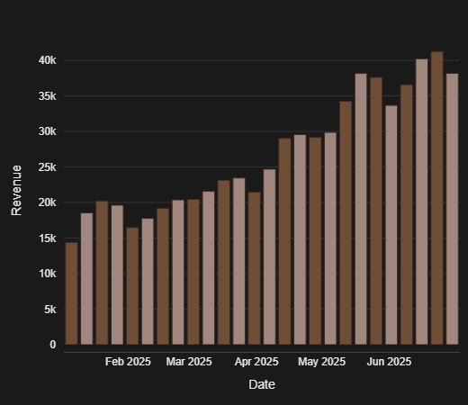

This Bar chart display the weekly trends. somewhere there is a decreasing of sales because of weekend and feb month (having 28 days) but as we see there is a increasing revenue month after month.

---

*Monthly Trend*
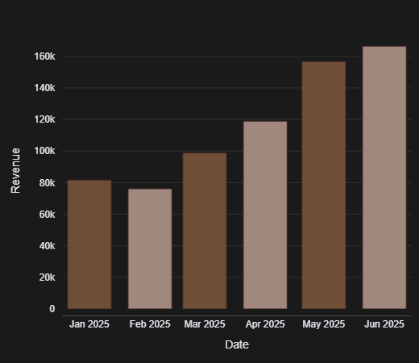

As we have already discussed then month after month the sales is in increasing order. In Monthly chart we can see bar in going in upward direction

---

*Store-level comparison*
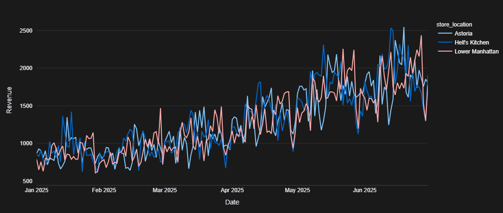

Line charts compare the revenue across the stores on daily. Based on Store performance the Hell’s Kitchen have a highest revenue whereas second highest store is Astoria then Lower Manhattan.
It is useful for dectecing the  **High-Performaning** and **Under-Performaning** location.

---

*Day of week performance*
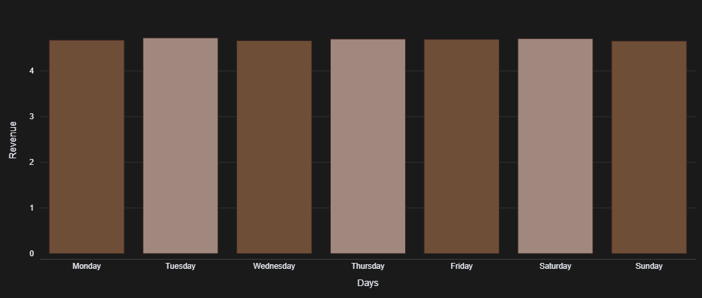
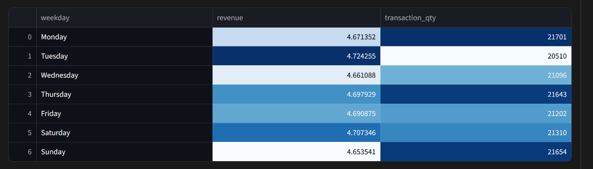

Compare the days revenue in which day sales can increase. On **Tuesday** the highest sales than other. If we see their is a slightly less sales rather than tuseday.

---

*Week vs Weekend Comparison*
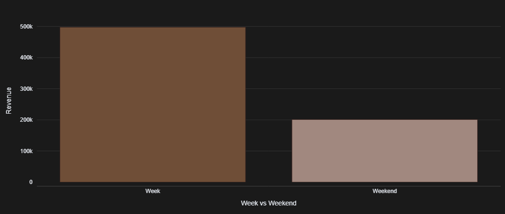

This chart compare the weekday and weekend sales. As we can observed, our workday’s revenue is highest than the leisure day which is (Saturday & Sunday).
**Help optimizing staffing and inventory**

---

*Workday and leisure day*
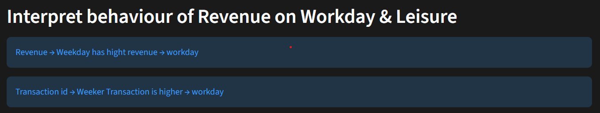

We have already compare the week vs weekend sales. so our workday create a more revenue than leisure day.
This is helpful for staffing and inventory.

---

*Houry demands*
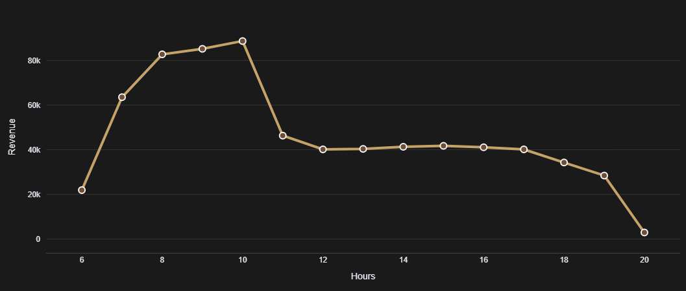

This is Hourly line chart to identify the peak hour as shown in diagram, at 10am there is a high frequency of sales is in morning.

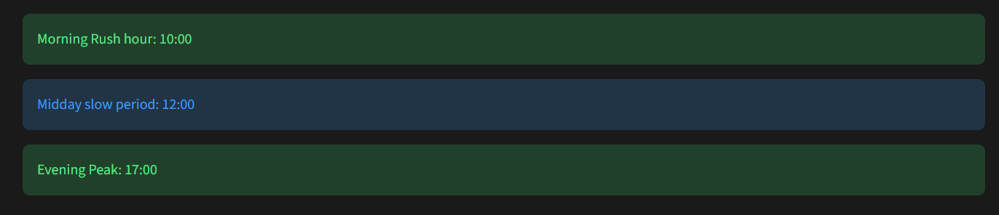

From Hourly analysis chart we can cleared that 10:00AM is a peak hour sales for all three stores and peakoff hours is in midday  (afternoon) around 12PM.

---

*Hourly revenue per store*
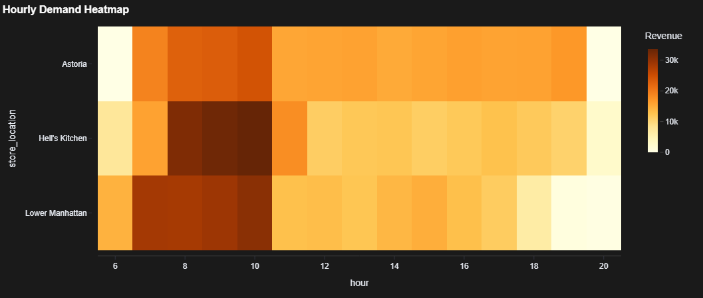

This visualization express the demand intensity. At what time will be high sales. As per visual observation in every store at 10am is a peak hour where customer visit in coffee store.

---

*Location specified customer behavior insight*

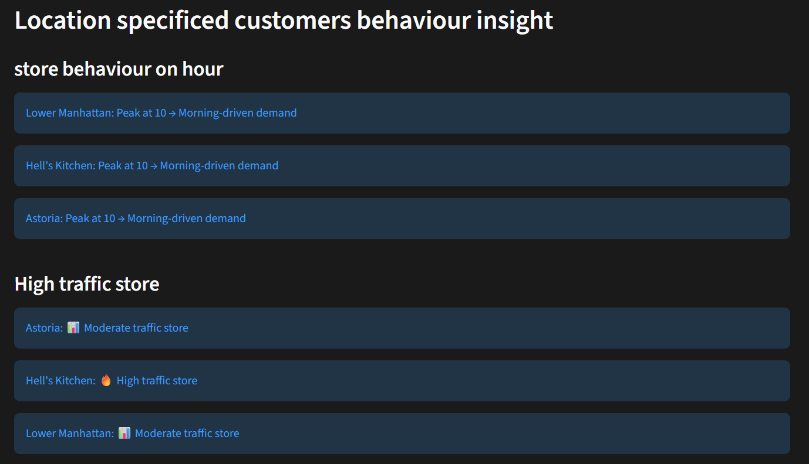

More customer visit after 9:30am and start more sales at peak hour, which is 10am. For all three stores same peak hour is 10am but customer traffic is different for stores. As we have visualized traffic store, at top Hell’s kitchen is high traffic store than other stores and moderate level is Astoria and Lower Manhattan. More sales done through Hell’s Kitchen store based on area or quality.

---

<h2><a class = "anchor" id = "watch-full-dashboard"></a>Watch Full Dashboard</h2>

**To watch the full dynamic Dashboard click on below link**
Afficionado Coffee Roaster Dashboard
- [Open Dashboard](https://afficionadocoffeeroaster.streamlit.app/)

---

<h2><a class = "anchor" id = "contact"></a>Contact</h2>


**Deepak Ramdhari Vishwakarma**
Data Analyst (Pursing)
Email: deepakvishwakarma1302@gmail.com
Contact no.: 7045669414
